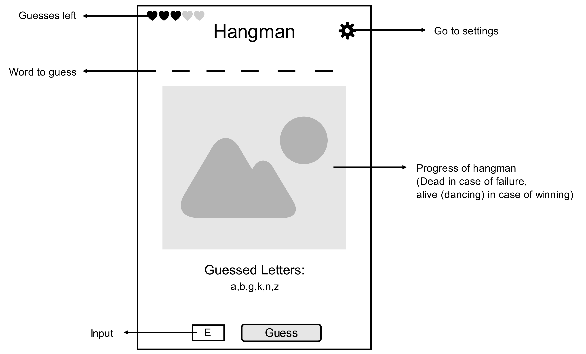
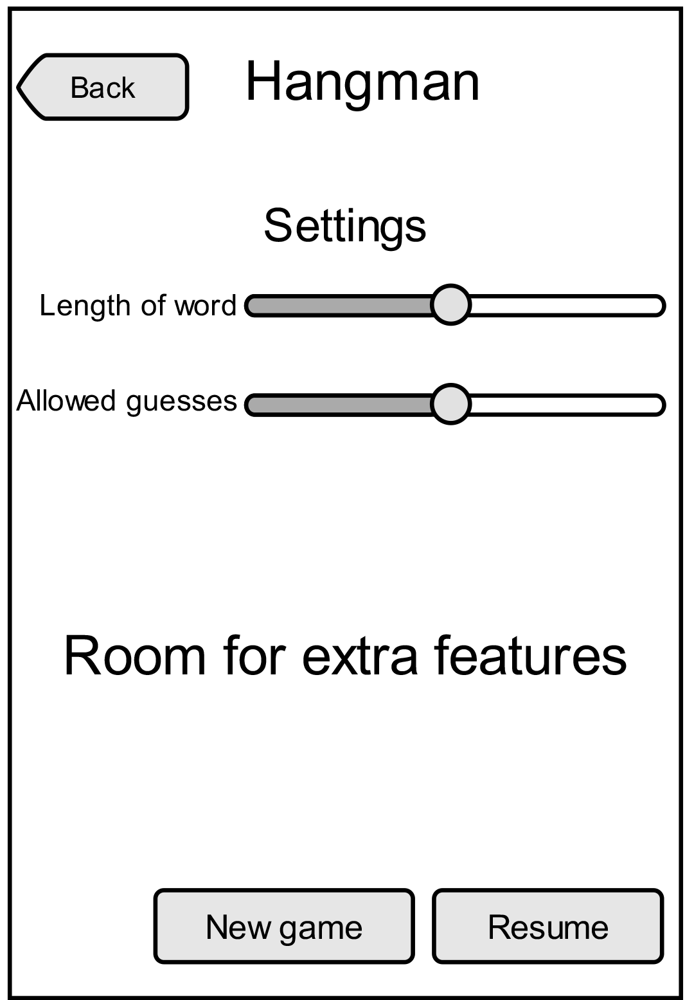
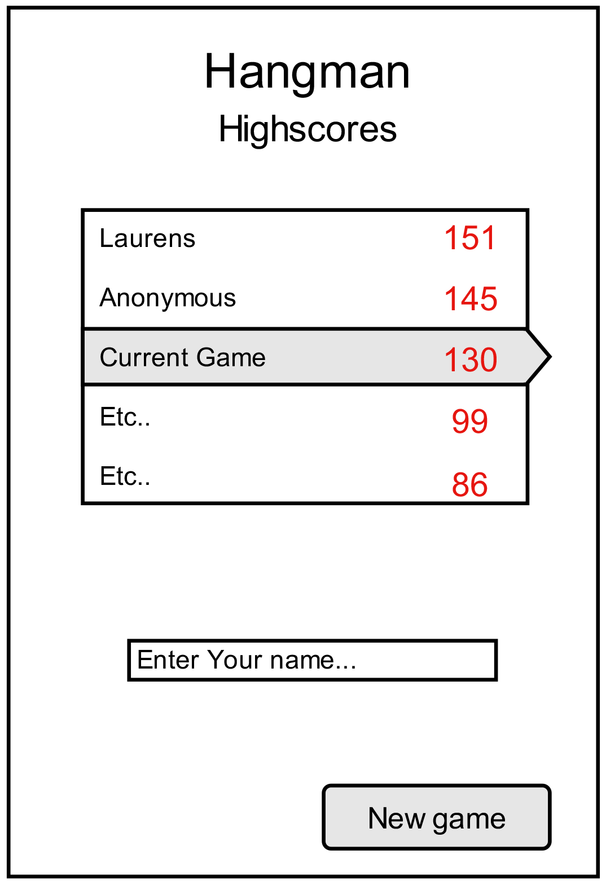

Hangman
=======

**author:** Laurens Verspeek - 10184465 
            laurens_verspeek@hotmail.com

**course:** Native App Studios - Univeristy of Amsterdam

_Hangman is an application for Android based on the classic Hangman game for the course Native App Studios_

###Features###
- placeholders for yet-unguessed letters that make clear the word’s length.
- displays how many guesses left until you lose
- displays all letters you already guessed
- User can give input guesses via an on-screen keyboard.
- app only accepts single alphabetical characters as valid input (case-insensitively).
- Congratulation popup after you win
- Changable settings, like the length of words to be guessed and the maximum number of incorrect guesses allowed
- Option to start a new game in settings menu
- Maintains a history of high scores that’s displayed anytime a game is won or lost. 

###Technologies###
- Android SDK (java)
- Canvas with SurfaceView (http://developer.android.com/guide/topics/graphics/2d-graphics.html)

###Mockups###

